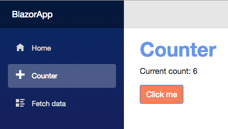

# Getting Started

If you haven't done so, please [install Bionic](../0_install) first.

## Create a Blazor project

First, create a Blazor Standalone or Hosted project using Blazor Templates.

You can check for the available templates using:

```text
> dotnet new -l
```

Among others, the following templates should be available:
```text
Templates                                         Short Name            Language          Tags
-------------------------------------------------------------------------------------------------------------------------------
Blazor (hosted in ASP.NET server)                 blazorhosted          [C#]              Web/Blazor/Hosted
Blazor Library                                    blazorlib             [C#]              Web/Blazor/Library
Blazor (Server-side in ASP.NET Core)              blazorserverside      [C#]              Web/Blazor/ServerSide
Blazor (standalone)                               blazor                [C#]              Web/Blazor/Standalone
```

If the above templates are not available, then install them using:

```text
> dotnet new -i Microsoft.AspNetCore.Blazor.Templates
```

Create and build a Blazor Standalone project:

```text
> dotnet new blazor -o BlazorApp
> cd BlazorApp
> dotnet run
...
Now listening on: http://localhost:5000
Now listening on: https://localhost:5001
Application started. Press Ctrl+C to shut down.
```

Finally, point your browser to http://localhost:5000 and verify that the app is running.

You can shut down the server once you've verified that it is working.

## Initializing Bionic

Before we can do anything else with Bionic, we need to first initialize our project with it. This step is only required once per project.

```text
> bionic start
```

## Serving Bionic for the first time

You can now build and serve your project. This command will also rebuild whenever a source code or scss change is detected.

```text
> bionic serve
```

Please note that it will not hot-reload the page for you. You'll have to keep an eye on the server and reload when compilation has completed.

## Bionic is your friend

Bionic command line can help you.  You can continue to add --help to longer commands for contextual help.

```text
bionic --help
```

## Generating Services (AKA Providers) for your project

Services require both an interface and its implementation. In addition, they also need to be registered with the Dependency Injection service before being used. With Bionic, the [Injectable] attribute is used to inject the service automatically minimizing the amount of changes required.

Let's start by creating a new CounterService for the project:

```text
bionic generate service CounterService
🚀  Generating a service named CounterService
The template "Bionic Service Template" was created successfully.
```

This will create:
```text
Services/Interfaces/ICounterService.cs
Services/CounterService.cs
```

Open the created files using your favorite editor or IDE.

Update your ICounterService interface to look like:

```c#
public interface ICounterService
{
  int count {get; set;}
  void Increment();
}
```

And your CounterService implementation to look like:

```c#
using BionicExtensions.Attributes;

[Injectable(typeof(ICounterService))]
public class CounterService : ICounterService
{
  public int count {get; set;} = 0;
  public void Increment() => count++;
}
```

## Generating a new Component

Pages, Layouts, Components and Services can also be generated through an interactive CLI process:

```text
> bionic bionic -g
What would you like to generate?
 (component, layout, page or service/provider):  component
How would you like to name your component? CounterComponent
🚀  Generating a component named CounterComponent
The template "Bionic Component Template" was created successfully.
```

This will create:
```text
Component/
  CounterComponent.cshtml
  CounterComponent.scss
```

Let's implements the CounterComponent.cshtml to be:

```html
@using Microsoft.AspNetCore.Blazor.Components
@inject ICounterService CounterService;

<div component="CounterComponent">
  <h1>Counter</h1>

  <p>Current count: @CounterService.count</p>

  <button class="btn btn-primary" onclick="@CounterService.Increment">Click me</button>
</div>

@functions {
    // Add your component functions here
}
```

And update your CounterComponent.scss to:

```scss
div[component="CounterComponent"] {
  h1 {
    font-weight: bold;
    color: cornflowerblue;
  }
  button {
    background-color: coral;
  }
}
```

Now edit you Pages/Counter.cshtml page and set it to:

```html
@page "/counter"

<CounterComponent />

@functions {
}
```

Let *bionic serve* complete the build and then refresh your browser to contemplate the final result.




You can now pick and choose where else you would like to deploy your app:

[Android](../platforms/capacitor/android), [Electron](../platforms/electron) or [iOS](../platforms/capacitor/ios)
